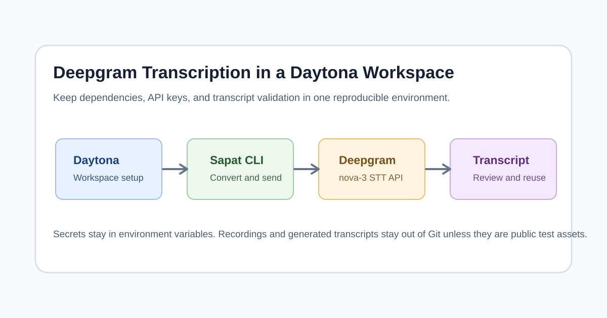

## TL;DR

Sapat is a Python command-line tool for turning audio or video files into text.
With a Daytona workspace, an AI engineer can keep the transcription runtime,
Python dependencies, `ffmpeg`, and provider credentials isolated from the local
machine. This guide walks through a Deepgram-backed workflow: create the
workspace, configure `DEEPGRAM_API_KEY`, run Sapat against a sample recording,
review the transcript, and keep the setup reproducible for future jobs.



## Why Use Daytona for Transcription Workflows

AI transcription looks simple until the environment starts to drift. One laptop
has a different Python version, another is missing `ffmpeg`, and a third has an
old package cache that changes provider behavior. A
[Daytona Workspace](https://www.daytona.io/definitions/d/daytona-workspace)
keeps those details in a repeatable development environment that can be opened,
shared, rebuilt, and discarded without touching the host machine.

That matters when you are testing a speech-to-text workflow for meetings,
customer interviews, product demos, or lectures. The audio may be private, the
API key should never be committed, and the output needs to be traceable. Daytona
gives you a clean workspace boundary; Sapat gives you a single CLI; Deepgram
provides the transcription model.

The companion Sapat contribution for this guide adds a Deepgram provider that
uses Deepgram's pre-recorded transcription endpoint. It is configured through
`DEEPGRAM_API_KEY`, defaults to `nova-3`, and sends the request with
`smart_format=true` so the output is easier to read.

## What You Will Build

By the end of this guide, you will have:

- A Daytona workspace created from the Sapat repository.
- A Python environment with Sapat dependencies installed.
- `ffmpeg` available for audio conversion.
- A local `.env` file that stores your Deepgram API key outside Git.
- A repeatable command for transcribing one file or a directory of `.mp4`
  files.
- A small validation checklist for checking that the provider, output file, and
  transcript quality are working.

The workflow is useful for AI engineers who need transcripts as upstream
context for summarization, RAG ingestion, support triage, or model evaluation.
It is also useful when you want a reproducible sandbox for testing a new
transcription provider before you wire it into a larger automation.

## Prerequisites

You need:

- A Daytona installation or hosted Daytona account.
- A Deepgram API key.
- A small audio or video sample that you are allowed to process.
- Basic comfort with a terminal.

Do not use private customer recordings for the first run. Start with a short
sample so you can inspect behavior quickly and avoid unnecessary API usage.

## Step 1: Create the Daytona Workspace

Create a workspace from the Sapat repository:

```bash
daytona create https://github.com/nkkko/sapat --code
```

Open the workspace in your editor from Daytona. The repository already contains
the Sapat CLI and provider framework. If you are testing the Deepgram provider
before it is released upstream, use the companion PR branch that adds it:

```bash
git fetch origin pull/74/head:deepgram-provider
git checkout deepgram-provider
```

The important point is that the provider code and the transcription job run
inside the workspace, not on a half-configured local machine.

## Step 2: Install Runtime Dependencies

Inside the workspace, install system and Python dependencies:

```bash
sudo apt-get update
sudo apt-get install -y ffmpeg
python -m pip install --upgrade pip
python -m pip install -r requirements.txt
python -m pip install -e .
```

Check the CLI:

```bash
sapat --version
sapat --help
```

If `sapat` is not on `PATH`, run it through Python:

```bash
python -m sapat.cli --help
```

## Step 3: Store Deepgram Credentials Safely

Create a local `.env` file in the workspace root:

```bash
cat > .env <<'EOF'
DEEPGRAM_API_KEY=replace_with_your_key
EOF
```

Keep this file out of Git. Sapat checks provider availability from environment
variables, so the Deepgram provider only appears when `DEEPGRAM_API_KEY` is set.
Load it for the current shell:

```bash
set -a
. ./.env
set +a
```

You can also set the variable in Daytona's workspace environment settings if
your team manages secrets centrally. The key rule is simple: do not paste API
keys into articles, commit messages, screenshots, test fixtures, or transcripts.

## Step 4: Prepare a Small Test File

Copy a short `.mp4` or `.mp3` file into the workspace. For example:

```bash
mkdir -p samples
cp ~/Downloads/demo-meeting.mp4 samples/demo-meeting.mp4
```

For the first validation, keep the file under a few minutes. That makes it easy
to compare the transcript with the source audio and spot formatting or language
issues.

## Step 5: Run Sapat with Deepgram

Run the transcription command:

```bash
sapat samples/demo-meeting.mp4 \
  --provider deepgram \
  --model nova-3 \
  --language en \
  --quality M
```

Sapat converts the input into the provider's preferred audio format, sends it to
Deepgram, and writes the transcript next to the input file:

```bash
samples/demo-meeting.txt
```

Review the transcript:

```bash
sed -n '1,80p' samples/demo-meeting.txt
```

Deepgram's `smart_format=true` setting helps format numbers, dates, and common
spoken patterns into readable text. If your source audio is not English, pass
the appropriate language code:

```bash
sapat samples/interview.mp4 --provider deepgram --language es
```

## Step 6: Process a Directory

Sapat can process every `.mp4` in a directory:

```bash
sapat samples --provider deepgram --model nova-3 --language en --quality L
```

This is useful when you have multiple demo clips or interviews from the same
research batch. Keep batches small until you understand cost and runtime. For a
larger queue, commit only the workflow instructions and never the recordings or
generated transcripts unless they are public test assets.

## Step 7: Validate the Provider Without a Real API Call

The Deepgram provider contribution includes mock-based tests. They check that
Sapat sends:

- `Authorization: Token <DEEPGRAM_API_KEY>`
- `model=nova-3`
- `language=<your language>`
- `smart_format=true`

Run the focused test:

```bash
python -m pytest tests/providers/test_deepgram.py -q
```

If you are changing the provider implementation, run the registry tests too:

```bash
python -m pytest tests/test_registry.py tests/providers/test_deepgram.py -q
```

Mocked tests are important for provider integrations because they verify the
request contract without spending credits or requiring contributors to expose
real credentials.

## Quality Checklist for Production Notes

Before you move from a sample file to a real workflow, write down a small
quality checklist. Transcription quality is not a single pass or fail result;
it depends on the recording conditions, speaker accents, microphone distance,
background noise, and how you plan to use the text later.

For a meeting transcript, check that names, project terms, decisions, and
numbers survived correctly. For a demo transcript, check that product names,
commands, file paths, and error messages are readable. For a research
interview, check that questions and answers remain distinguishable enough for
analysis. If the transcript will be used in a RAG pipeline, record whether
timestamps, speaker labels, or section headings need to be added in a later
step.

Keep this checklist in the repository as documentation, not as a transcript
artifact. That gives future contributors the review standard without exposing
private audio or text.

## Troubleshooting

### The Deepgram Provider Is Not Available

Confirm the environment variable is loaded:

```bash
printenv DEEPGRAM_API_KEY
```

If it is blank, reload `.env`:

```bash
set -a
. ./.env
set +a
```

### The CLI Cannot Find `ffmpeg`

Install it in the Daytona workspace:

```bash
sudo apt-get update
sudo apt-get install -y ffmpeg
```

Then verify:

```bash
ffmpeg -version
```

### The Transcript Is Empty

Check that the recording has an audio stream:

```bash
ffprobe samples/demo-meeting.mp4
```

If the file is silent or has an unsupported stream, convert it manually to a
known-good MP3 and try again.

### The API Returns 401 or 403

Regenerate or rotate the Deepgram API key, reload the shell environment, and
retry with a short sample. Avoid putting the key directly in the command history
if your environment records terminal sessions.

## Turning Transcripts Into AI Engineering Inputs

Once the transcript is generated, use it as a stable artifact for downstream AI
work:

- Summarize a user interview into jobs-to-be-done notes.
- Extract action items from a design review.
- Chunk the transcript into a vector database for retrieval.
- Compare model summaries against the original transcript during evaluation.

Daytona keeps that pipeline reproducible. If another engineer needs to inspect
the same workflow, they can open the workspace, load their own credentials, and
run the same Sapat command against a permitted sample file.

## Cleanup

Remove local samples and transcripts when you are done:

```bash
rm -rf samples
```

If the recordings were sensitive, also rotate any temporary credentials and
destroy the workspace. A clean workspace lifecycle is part of the security
model: keep code and instructions in Git, keep secrets and private media out.

## Conclusion

Deepgram gives Sapat another practical speech-to-text backend, and Daytona makes
the workflow repeatable. The combination is straightforward: create the
workspace, install dependencies, load `DEEPGRAM_API_KEY`, run Sapat with
`--provider deepgram`, and validate the output with a short sample before
running larger jobs.

That simple loop is enough for many AI engineering tasks. You get transcripts
that can feed summaries, RAG pipelines, QA checks, or product research, while
keeping credentials and media inside a controlled workspace instead of scattered
across local machines.
